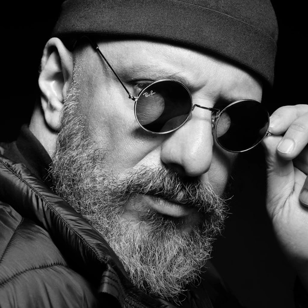
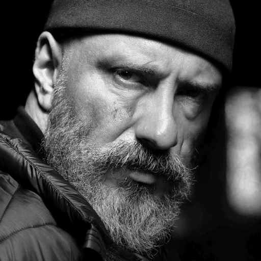

# sync-SDE

Official implementation of **Semantic Editing with Coupled Stochastic Differential Equations**.

sync-SDE is a training-free semantic image editing method for out-of-the-box pretrained text-to-image models that admit SDE sampling, including diffusion/rectified flow models such as FLUX.1 and FLUX.2. It couples the source and target reverse-time paths with a shared backward Brownian motion, changing prompt semantics while preserving fine structure.

**Links:** [Project page](https://z-jianxin.github.io/syncSDE-release/) · [arXiv](https://arxiv.org/abs/2509.24223) · [Hugging Face demo](https://huggingface.co/spaces/jianxinz/syncSDE-release)

## Highlights

- Training-free, optimization-free editing.
- No auxiliary editing network.
- Supports ordinary positive prompt edits and negative-prompt edits.
- Works with SDE sampling paths for diffusion/rectified flow models.

## Examples

The project page in `docs/` shows a larger gallery with full source/target prompts and highlighted edited text.

| Source | Edit | Result |
| --- | --- | --- |
|  | `09 02 11` -> `IC LR 26` |  |
|  | `spoon` -> `fork` |  |
|  | `sunflowers` -> `tulips` |  |
|  | black and white -> colored |  |
|  | negative prompt: `sunglasses` |  |
|  | negative prompt: `straw` |  |

## Setup

Create and activate a Conda environment:

```bash
conda create -n syncSDE python=3.13 -y
conda activate syncSDE
```

Install the essential runtime packages:

```bash
conda install -c pytorch -c nvidia -c conda-forge \
   pytorch torchvision pytorch-cuda=12.8 \
   numpy pillow matplotlib gradio accelerate transformers \
   sentencepiece protobuf safetensors einops pip -y

python -m pip install "diffusers>=0.38.0" "bitsandbytes>=0.49.2"
```

`diffusers>=0.38.0` is needed for FLUX.2 support, and `bitsandbytes` is needed for the default 4-bit FLUX.2 demo path.

## Run Demo

Start the Gradio demo:

```bash
python gradio_demo_flux.py --share
```

A public link will appear in the terminal. Open it in your browser and interact with the demo.

You can also use the hosted [Hugging Face Space](https://huggingface.co/spaces/jianxinz/syncSDE-release). Feel free to start the Space if it is sleeping.

## Citation

```bibtex
@inproceedings{zhang2026semantic,
  title = {Semantic Editing with Coupled Stochastic Differential Equations},
  author = {Zhang, Jianxin and Scott, Clayton},
  booktitle = {Proceedings of the 43rd International Conference on Machine Learning},
  year = {2026},
  url = {https://arxiv.org/abs/2509.24223}
}
```

## Credits

Our code is built upon the release of RF-Inversion: https://github.com/LituRout/RF-Inversion

```bibtex
@inproceedings{
    rout2025semantic,
    title={Semantic Image Inversion and Editing using Rectified Stochastic Differential Equations},
    author={Litu Rout and Yujia Chen and Nataniel Ruiz and Constantine Caramanis and Sanjay Shakkottai and Wen-Sheng Chu},
    booktitle={The Thirteenth International Conference on Learning Representations},
    year={2025},
    url={https://openreview.net/forum?id=Hu0FSOSEyS}
}
```
